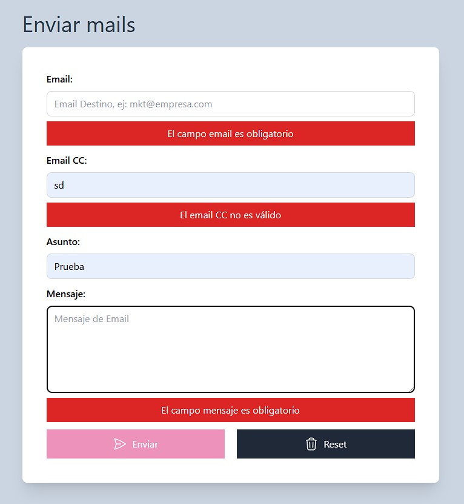

# Miniform Validation

Formulario básico, en donde se validan campos requeridos, y un email correcto, hecho en vainilla JavaScript.

- Validación campos requeridos(email, asunto, mensaje).
- Bloqueo boton submit.
- Se simula el envio de datos a un servidor.
- Reseteo formulario.

## Screenshots

